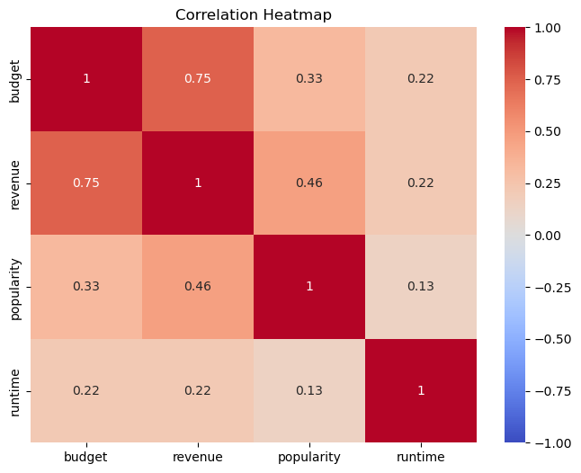

# 🎬 **Dataflix: Lights, Camera, Classification** 🍿


Welcome to our movie data adventure, where we dive deep into the fascinating world of movies, budgets, and box office success! In this project, we’ll build a **movie classification model** to predict whether a film will be a **hit** or a **miss** based on its features. Sounds fun, right?  

Let’s get started with this beginner-friendly project and bring **Dataflix** to life! 🎥✨

# Table of Contents

1. [**The Challenge: Predicting Movie Success**](#the-challenge-predicting-movie-success)
2. [**Dataset Overview**](#-dataset-overview)
3. [**Data Cleaning Pipeline**](#-data-cleaning-pipeline)
4. [**Exploratory Data Analysis (EDA)**](#exploratory-data-analysis)
5. [**Feature Engineering: Preparing Data for Machine Learning**](#-feature-engineering-preparing-data-for-machine-learning)
6. [**Modeling Approach:Finding the Best Movie Success Predictor**](#-modeling-approach-finding-the-best-movie-success-predictor)
7. [**Integration into Dash App**](#integration-into-dash-app)
8. [**Reproducibility: Deployment and Dockerization**](#-reproducibilitydeployment-and-dockerization-)
   - [**Model Deployment with Dash**](#1-model-deployment-with-dash-)
   - [**Containerization with Docker**](#2-containerization-with-docker-)
   - [**Deploying to Kubernetes)**](#3-deploying-to-kubernetes-)


---

# 🌟🎬  The Challenge: Predicting Movie Success 

Imagine yourself, not as a movie director juggling actors and scripts, but as a **data scientist** uncovering the secrets behind cinematic success.

- **Your script?** A rich dataset. 📊  
- **Your cast?** A diverse set of features. 🎭 
- **Your ultimate goal?** Predict a movie's box office fate. 💰  

Movies are unpredictable—some soar to **blockbuster status**, while others fade into obscurity. But what if we could classify films as **Blockbuster, Hit, or Flop** using **budget, genre, and popularity**?  


 
## ❓ The Mission: Unlocking the Formula for Hits  


Data-driven insights have the power to **revolutionize decision-making** for filmmakers, producers, and studios. By analyzing past trends, we can:  

✅ Identify key patterns that define successful films.  
✅ Predict future box office performance with greater accuracy.  
✅ Empower creators to make informed, strategic decisions. 

Using historical film data, our task is to **classify movies as hits or misses** based on their attributes.  


## 🔍 Key Questions to Explore  
1. What factors truly determine a movie’s success? 🎬 
2. Can elements like **budget, genre, and cast popularity** help predict outcomes? 🤔  
3. Are there hidden trends in movie data that give us an advantage? 🔎 

Let’s dive into the data and find out! 🔥  


---

# 📊 Dataset Overview


The dataset contains metadata for **7,398 movies**, sourced from the **TQDM competition on Kaggle** ([TMDB Box Office Prediction](https://www.kaggle.com/competitions/tmdb-box-office-prediction/data)).  While the competition's goal is to build a regression model to predict a movie's international box office revenue, we’re taking a different approach. 

We simplify the problem by **classifying movies into performance categories** rather than just predicting precise revenue figures. This approach not only makes the analysis more approachable but also uncovers valuable insights about the factors that influence movie success.


## 🎥 The Movie Performance Categories


Movies are classified based on their anticipated box office performance. To simplify classification, the **Below Average, Average, and Above Average** categories were merged into a single **Medium** class.

| **Final Class**   | **Original Category**  | **Description**                                    | **Revenue Range**                 |
|------------------|---------------------|------------------------------------------------|----------------------------------|
| **Blockbuster**  | Blockbuster         | Phenomenal success, massive earnings.         | ≥ $500,000,000                  |
| **Hit**         | Hit                 | Exceptionally well-performing movie.          | $100,000,000 – $499,999,999      |
| **Medium**      | Above Average        | Exceeds basic financial expectations.         | $50,000,000 – $99,999,999        |
| **Medium**      | Average              | Meets standard benchmarks.                    | $25,000,000 – $49,999,999        |
| **Medium**      | Below Average        | Slightly underperforms expectations.         | $10,000,000 – $24,999,999        |
| **Flop**        | Flop                 | Fails to recoup production costs significantly. | < $10,000,000                    |

---

## 🎥 Meet the Cast of Features


Each entry provides various details about the movie, including production, cast, and box office performance. Below is a breakdown of the features included in the [dataset](data/tmdb-box-office-prediction/train.csv):
| **Feature**              | **Description**                                                                                                                                                        | **Data Type**      |
|--------------------------|--------------------------------------------------------------------------------------------------------------------------------------------------------------------|--------------------|
| `id`                     | Unique identifier for each movie.                                                                                                                                   | Integer            |
| `belongs_to_collection`  | Information about the movie collection it belongs to, if any (e.g., series or franchise).                                                                            | JSON/Object        |
| `budget`                 | The production budget of the movie.                                                                                                                                  | Numeric            |
| `genres`                 | A list of genres associated with the movie (e.g., Comedy, Action).                                                                                                  | JSON/List          |
| `homepage`               | The official website URL of the movie.                                                                                                                              | String (URL)       |
| `imdb_id`                | The movie's unique identifier on IMDb.                                                                                                                               | String             |
| `original_language`      | The primary language in which the movie was produced.                                                                                                                | String (ISO Code)  |
| `original_title`         | The movie's original title.                                                                                                                                          | String             |
| `overview`               | A brief description or synopsis of the movie.                                                                                                                        | String             |
| `popularity`             | A numeric score representing the movie's popularity.                                                                                                                 | Float              |
| `poster_path`            | Relative path to the movie's poster image.                                                                                                                            | String (Path)      |
| `production_companies`   | A list of production companies involved in making the movie.                                                                                                          | JSON/List          |
| `production_countries`   | A list of countries where the movie was produced.                                                                                                                     | JSON/List          |
| `release_date`           | The movie's release date.                                                                                                                                            | Date (MM/DD/YY)    |
| `runtime`                | The duration of the movie in minutes.                                                                                                                                | Numeric (Minutes)  |
| `spoken_languages`       | A list of languages spoken in the movie.                                                                                                                             | JSON/List          |
| `status`                 | The release status of the movie (e.g., Released, Post-Production).                                                                                                   | String             |
| `tagline`                | The tagline or slogan associated with the movie.                                                                                                                     | String             |
| `title`                  | The movie's title.                                                                                                                                                   | String             |
| `Keywords`               | A list of keywords associated with the movie (e.g., time travel, sequel).                                                                                           | JSON/List          |
| `cast`                   | A list of cast members, including their roles and metadata (e.g., character name, actor details).                                                                    | JSON/List          |
| `crew`                   | A list of crew members involved in the movie, including their roles (e.g., director, producer).                                                                      | JSON/List          |
| `revenue`                | The movie's total revenue at the box office.                                                                                                                         | Numeric            |

---

### 📝 Notes on Data:
- **Nested Data**: Some features (e.g., `genres`, `cast`, `production_companies`) are in JSON format, requiring additional preprocessing to extract useful information.
- **Missing Data**: Certain fields (e.g., `homepage`, `tagline`) may have missing or incomplete values, requiring handling during data cleaning.
- **Complex Relationships**: Features such as `cast` and `crew` offer rich, detailed information but may need transformation for analysis.

---


# 🛠 Data Cleaning Pipeline


| **Step**                   | **Description**                                                                                      |
|----------------------------|------------------------------------------------------------------------------------------------------|
| **1. Utility Functions**   | - Standardized `release_date` and adjusted years > 2017 (e.g., 2068 → 1968).                        |
|                            | - Parsed JSON-like columns (e.g., `genres`, `crew`) into usable formats.                            |
|                            | - Fixed text encoding issues and removed unnecessary characters.                                     |
| **2. Parsing & Extraction**| - Parsed JSON columns: `genres`, `Keywords`, `cast`, `crew`, etc.                                   |
|                            | - Extracted key fields:                                                                              |
|                            |   - `genres_extracted`: Genre names.                                                                |
|                            |   - `top_cast`: Top 3 billed actors.                                                                |
|                            |   - `directors`: Movie directors.                                                                   |
|                            |   - `keywords_extracted`: Key terms describing the movie.                                           |                                                             |
| **3. Data Cleaning**       | - Corrected future years in `release_date` (e.g., 2068 → 1968).                                     |
|                            | - Fixed encoding issues in text fields.                                                             |
|                            | - Replaced missing values:                                                                          |
|                            |   - Median for `runtime`, `budget`, and `revenue`.                                                  |
|                            |   - Blank strings for text fields.                                                                 |
| **4. Dropping Columns**    | Removed unnecessary fields: `poster_path`, `homepage`, and raw JSON fields.                         |
| **5. Save Cleaned Data**   | Saved the cleaned dataset as `data/cleaned_movies.csv`.                                                  |

---
# 🧪 Exploratory Data Analysis (EDA)

## 1. Basic Data Overview
Inspected dataset shape, missing values, and basic statistics.

| **Metric**       | **Value**       |
|-------------------|-----------------|
| **Rows**         | 3,000           |
| **Columns**      | 21              |

---

### Missing Values
| **Column**                   | **Missing Count** | **Percentage** |
|------------------------------|--------------------|----------------|
| `tagline`                    | 597               | 19.9%          |
| Other Columns                | 0                 | 0%             |

---

### Descriptive Statistics (Numeric Columns)
| **Feature**     | **Mean**    | **Std. Dev.** | **Min**        | **25%**       | **50%**       | **75%**       | **Max**         |
|------------------|-------------|---------------|----------------|---------------|---------------|---------------|-----------------|
| `budget`         | 26.86M      | 35.02M        | 1              | 9M            | 16M           | 29M           | 380M            |
| `popularity`     | 8.46        | 12.10         | 0.000001       | 4.02          | 7.37          | 10.89         | 294.33          |
| `runtime`        | 107.85 mins | 22.08 mins    | 0 mins         | 94 mins       | 104 mins      | 118 mins      | 338 mins        |
| `revenue`        | 66.72M      | 137.53M       | 1              | 2.37M         | 16.80M        | 68.91M        | 1.52B           |

---

### 🔑  Key Takeaways:
- **Missing Values**:
  - The `tagline` column has 19.9% missing values; all other columns are complete.
- **Skewness**:
  - Both `budget` and `revenue` are highly skewed, with maximum values significantly larger than the mean.
- **Popularity**:
  - Wide range from near-zero values to a maximum of 294.33.
- **Runtime**:
  - Most movies are between 94 and 118 minutes, with a maximum runtime of 338 minutes.

## 2. Numeric Feature Distributions: Budget, Revenue, Popularity & Runtime
 - Analyzed distributions for key features 
(`budget`, `revenue`, `popularity`, `runtime`).


| **Feature**    | **What We See (Observation)**                                                                   | **What It Means (Interpretation)**                                                                                   |
|---------------|------------------------------------------------------------------------------------------------|-------------------------------------------------------------------------------------------------------------------|
| **Budget**    | Most movies have **small budgets**, but a few blockbusters have **very high budgets**. | This shows that making movies is **uneven**—many are made on low budgets, while a few big productions get huge funding. |
| **Revenue**   | Most movies make **low revenue**, but a few earn **huge amounts**. | A small number of blockbuster movies make **most of the money**, while many struggle at the box office. |
| **Popularity**| Most movies have **moderate popularity**, but a few are **extremely popular**. | Some movies go **viral** or become **cult favorites**, while most just gain average public interest. |
| **Runtime**   | Most movies are between **90-120 minutes**, but a few are much longer (up to 338 minutes). | This is the **standard length** for most films, but longer movies are usually **epic films or documentaries**. |

---

### 🔑 Key Takeaways:
- **Big budgets don’t always mean big success**, but the highest-earning movies tend to have larger budgets.
- **Only a few movies make huge profits**, while most earn **moderate to low revenue**.
- **Popularity is unpredictable**—some movies explode in fame, while others remain unnoticed.
- **Most films stick to a standard runtime** of 90-120 minutes, with longer ones being special cases.


## 3. Correlation Analysis
- Explored relationships between numeric features using a heatmap.



---


| **What We’re Comparing**        | **Correlation Strength** | **What It Means (Beginner-Friendly Explanation)**                                                    |
|---------------------------------|-------------------------|------------------------------------------------------------------------------------------------------|
| **Budget & Revenue**            | ⭐⭐⭐ **Strong (0.75)**     | Bigger budgets **usually** lead to higher revenue, but it’s not guaranteed.                         |
| **Budget & Popularity**         | ⭐⭐ **Moderate (0.34)**  | Expensive movies **tend to be more popular**, but there are exceptions.                            |
| **Budget & Runtime**            | ⭐ **Weak (0.24)**       | Higher-budget films are **slightly longer**, but budget doesn’t strongly affect runtime.           |
| **Revenue & Popularity**        | ⭐⭐ **Moderate (0.46)**  | More popular movies **tend to make more money**, but some popular films don’t earn much.           |
| **Revenue & Runtime**           | ⭐ **Weak (0.22)**       | Slightly longer movies **might** earn more, but runtime isn’t a big factor.                        |
| **Popularity & Runtime**        | ⭐ **Very Weak (0.13)**  | A movie’s length **doesn’t really** impact how popular it becomes.                                  |

---

### 🔑 Key Takeaways:
- 💰 **Big Budgets Help, But Don’t Guarantee Success** – Higher budgets **often** lead to higher earnings, but not always.
- 🌍 **Popularity Matters, But Isn’t Everything** – Popular movies **tend to** make more money, but not all do.
- ⏳ **Runtime Has Little Impact** – Whether a movie is short or long, it **doesn’t** strongly affect revenue or popularity.

This simplified breakdown makes it easier to **see which factors matter most** when predicting a movie’s success! 🎬🚀


## 4. Highlighted Movies: Budgets, Revenues, and Popularity

### 🔝 Top 5 Movies by Budget
| **Rank** | **Movie**                                  | **Budget ($M)** | **Revenue ($M)** |
|----------|------------------------------------------|----------------|----------------|
| 1        | Pirates of the Caribbean: On Stranger Tides | 380            | 1,045.7        |
| 2        | Pirates of the Caribbean: At World's End    | 300            | 961.0          |
| 3        | Avengers: Age of Ultron                   | 280            | 1,405.4        |
| 4        | Superman Returns                          | 270            | 391.0          |
| 5        | John Carter                               | 260            | 284.1          |

**📌 Insights:**
- The *Pirates of the Caribbean* franchise had the highest production budgets.
- *Avengers: Age of Ultron* stands out with **the highest revenue among high-budget films**, showing strong box office returns.
- *John Carter* had **one of the weakest performances**, with revenue barely exceeding its budget.

---

### 💰 Top 5 Movies by Revenue
| **Rank** | **Movie**                 | **Revenue ($B)** | **Budget ($M)** | **Popularity** |
|----------|---------------------------|----------------|----------------|----------------|
| 1        | The Avengers              | 1.52           | 220            | 89.89          |
| 2        | Furious 7                 | 1.51           | 190            | 27.28          |
| 3        | Avengers: Age of Ultron    | 1.41           | 280            | 37.38          |
| 4        | Beauty and the Beast      | 1.26           | 160            | 287.25         |
| 5        | Transformers: Dark of the Moon | 1.12      | 195            | 4.50           |

**📌 Insights:**
- **The Avengers** led revenue-wise, earning over **$1.5 billion**.
- **Beauty and the Beast** had a **high popularity score (287.25)**, showing strong audience engagement.
- Not all highly popular films generated massive box office success (e.g., *Transformers: Dark of the Moon* had a lower popularity score).

---

### 📉 Bottom 5 Movies by Revenue
| **Rank** | **Movie**                 | **Revenue ($)** | **Budget ($)** | **Popularity** |
|----------|---------------------------|----------------|----------------|----------------|
| 1        | The Wind in the Willows   | 1              | 12             | 1.41           |
| 2        | Mute Witness              | 1              | 2              | 2.47           |
| 3        | Missing                   | 1              | 16,000,000     | 0.23           |
| 4        | The Merry Widow           | 1              | 592            | 0.29           |
| 5        | Tere Naam                 | 2              | 1              | 1.28           |

**📌 Insights:**
- Some films had **extremely low revenue ($1-$2 total)** despite varying budgets.
- Even though their box office earnings were negligible, some movies still had **small niche followings** (e.g., *Mute Witness* had a popularity score of 2.47).

---

### 🌟 Top 5 Movies by Popularity
| **Rank** | **Movie**                  | **Popularity** | **Revenue ($M)** |
|----------|----------------------------|---------------|----------------|
| 1        | Wonder Woman                | 294.34        | 820.5          |
| 2        | Beauty and the Beast        | 287.25        | 1,262.9        |
| 3        | Baby Driver                 | 228.03        | 224.5          |
| 4        | Deadpool                    | 187.86        | 783.1          |
| 5        | Guardians of the Galaxy Vol. 2 | 185.33    | 863.4          |

**📌 Insights:**
- *Wonder Woman* was the most popular movie, showing **strong audience interest**.
- *Baby Driver* was **an outlier**, achieving **high popularity despite a lower budget**—likely due to **word-of-mouth marketing and soundtrack appeal**.

---

### 🔑 Key Takeaways:
| **Key Factor**            | **What We Learned** |
|---------------------------|--------------------|
| 💰 **Big Budgets**       | Franchise movies (e.g., *Pirates of the Caribbean, Avengers*) dominate high-budget rankings. |
| 🔥 **Popularity & Revenue** | A **high popularity score doesn’t always guarantee high revenue** (*Baby Driver* vs. *Beauty and the Beast*). |
| 🎥 **Box Office Risks**  | Some big-budget films (*John Carter*) underperformed despite massive investments. |

---

### 📊 Scatterplot Analysis: Revenue vs. Budget


🔍 **What we discovered from the scatterplot:**
- **Higher budgets tend to mean higher revenues**, but there's a **lot of variation**.
- Some **mid-budget movies ($50M–$150M) performed extremely well**, showing that **smart marketing and content matter**.
- **Low-budget movies** generally have **low revenues**, but some become **cult hits** over time.

### 🔑 Final Takeaways:
1. **Blockbusters dominate**: High-budget films usually earn the most, but **not always** (*John Carter* struggled).
2. **Popularity ≠ Guaranteed Success**: *Baby Driver* had high popularity but far less revenue than *Beauty and the Beast*.
3. **Budget ≠ Guaranteed Revenue**: Mid-budget films can **outperform expectations** if they capture audience interest.

📢 **Bottom Line**: The **film industry is unpredictable**, and success isn’t just about money—it’s about **timing, marketing, and audience connection**. 🎥✨

## 5. Genre and Keywords Analysis
### 🎬 Genre Word Cloud

- Created a **word cloud** to visualize the most common genres in the dataset.  
  


---

### 🏷️ Keyword Analysis
- Created a **visualization** to highlight **trending themes and concepts**.  


---

### 🔑 Key Takeaways:
1. **Popular Genres**: **Action, Drama,Thriller, and Comedy** dominate, likely because they appeal to a **wide audience**.  
2. **Trending Themes**: Keywords suggest that **independent film, based on novel , biography**  are in demand.  
3. **Industry Trends**: Studios likely **focus on themes that consistently perform well**, influencing future productions.  

📢 **Bottom Line:** Understanding **genre & keyword trends** helps predict what **audiences want** and how studios **shape movie production**! 🎥✨


## 6. Release Date Analysis: How Movie Releases Have Changed Over Time

### 📊 Movie Release Trends
- Analyzed how the **number of movie releases** has changed over the years.  
- Created a **trend chart** to visualize **industry growth and shifts**.  


---


### 🔑 Key Takeaways:

1. **📈 The Film Industry is Growing**  
   - More movies are being made than ever before, driven by **better technology and global demand**.  

2. **💻 The Digital Revolution Changed Everything**  
   - After **2000**, filmmaking became more accessible due to **lower production costs** and **digital distribution (e.g., DVDs, online platforms)**.  

3. **🎥 Streaming Services Fueled a Post-2010 Boom**  
   - The **rise of Netflix, Amazon Prime, and other streaming platforms** led to a **huge increase in movie production**.  
   - Filmmakers had **new ways to reach audiences** without relying on traditional theaters.  

4. **📉 Possible Recent Decline?**  
   - The **last recorded movie in our dataset is from 2017**, meaning we **don’t have data beyond that year**.  
   - Any **perceived decline** in movie releases might simply be due to the dataset’s timeframe, rather than an actual industry trend.  
   - However, real-world events like **market saturation, changing audience preferences, or shifts in distribution (e.g., streaming exclusives)** may have influenced production patterns after 2017.  


---

### 📢 **Bottom Line:**
- The **movie industry has evolved dramatically**, with technology shaping how films are made and distributed.  
- **Streaming platforms are key players**, allowing more creators to make movies without massive studio backing.  
- Understanding these trends helps **predict where the industry is heading** and what challenges it may face in the future. 🎥🚀  

## 7. Top 10 Directors by Average Revenue

### 📊 Who Are the Highest-Earning Directors?
- Ranked directors by **average revenue per movie** to identify the top performers.  
- Visualized the data to **see who dominates the box office**.  


---
### 🔍 What We Discovered
✅ **Joss Whedon Leads by a Huge Margin** – With an average revenue of **$1.46 billion**, he stands far ahead of others.  
✅ **Several Directors Have Exceeded $1 Billion** – Names like **Andrew Stanton, Angus MacLane, Byron Howard, Rich Moore, and Jared Bush** have all crossed this milestone.  

### 📢 What This Means
- **Big-budget franchise films and animated blockbusters dominate the industry.**  
- **Directors with consistent box office hits tend to work on sequels or high-profile studio projects.**  
- **Animation remains one of the most profitable genres, with directors seeing massive returns.** 
---

### 🔑 Key Takeaways:
1. **🎥 Blockbuster Directors Dominate**  
   - Directors like **Joss Whedon** (*The Avengers*) top the list thanks to the massive global success of their films.  
   - Other big names, like **David Yates** (*Harry Potter*) and **James Gunn** (*Guardians of the Galaxy*), owe much of their success to major franchises.  

2. **🎞️ Animation Directors Shine**  
   - Many high-earning directors are behind **animated hits** (*Zootopia, Finding Dory*).  
   - **Byron Howard, Rich Moore, and Jared Bush** prove that animated movies have **huge global appeal**.  

3. **🔗 Franchise Films Generate Massive Revenue**  
   - Many of the highest-earning directors have worked on **sequels, shared universes, or major studio-backed franchises**.  
   - These franchises bring in **repeat audiences**, leading to **higher box office numbers**.  

4. **🤝 Collaboration Leads to Success**  
   - Many top directors work as **part of a directing duo or team** (e.g., **Anthony Russo & Joe Russo**).  
   - Teamwork on **big-budget productions** often results in **high revenue outcomes**.  

---

 

📢 **Big Picture**: If you want **box office success**, directing a **franchise movie or a globally appealing animated film** is the way to go! 🎥✨  


## 8. Scatterplot Analysis: Budget vs. Popularity

### 📊 What We Analyzed  
- Plotted a **scatterplot** to explore how a movie’s **budget** affects its **popularity**.  


---

### 🔍 What We Discovered  
✅ **Higher Budgets = Higher Popularity (Usually)** – Movies with bigger budgets tend to be **more popular**, but not always.  
✅ **A Lot of Variation Exists** – Some **low-budget films still became very popular**, showing that **money isn’t everything**.  
### 📢 What This Means  
- **Big budgets help, but they don’t guarantee success**—a **great movie with strong marketing can still win big**.  
- **Mid-budget movies need to focus on genre and storytelling** to **stand out** in a competitive market.  
- **Indie films and niche genres can find success** even without a massive budget.  

---

### 🔑 Key Takeaways  
1. **💰 High-Budget Movies Are Usually More Popular**  
   - Movies with **$100M+ budgets** often **rank high in popularity**.  
   - This makes sense—**big budgets allow for huge marketing campaigns, A-list actors, and top-tier production quality**.  

2. **📉 Mid-Budget Movies Have Mixed Results**  
   - Films in the **$10M–$50M range** show **a wide variation in popularity**.  
   - This means that **budget alone isn’t the deciding factor**—other things like **genre, story quality, and marketing** matter a lot.  

3. **🎭 Some Low-Budget Films Break Through**  
   - Some **low-cost movies (<$10M) became very popular**, likely due to **strong word-of-mouth or niche audiences**.  
   - Examples could include **indie hits, horror films, or viral social media successes**.  

4. **🚀 Outliers Prove That Creativity Wins**  
   - A few **highly popular movies** had **low budgets**, showing that **great storytelling or unique marketing strategies** can **outshine financial limitations**.  

📢 **Bottom Line:** While **money helps**, success in the movie industry is **a mix of creativity, marketing, and audience connection**! 🎥✨  


# 🔧 Feature Engineering: Preparing Data for Machine Learning

### 🏗️ Why Feature Engineering Matters  
Feature engineering **transforms raw data into meaningful features**, improving machine learning model performance. Below are the key steps taken in this project.

---

### 🔍 Key Feature Engineering Steps  

| **Step**                 | **What We Did** | **Why It’s Important** |
|--------------------------|----------------|------------------------|
| **📉 Handling Missing Values** | Replaced missing text fields (`description`, `director`, `genre`) with `""` (empty string) and numerical fields (`budget`, `average_cast_pop`) with `0.0`. | Ensures models don’t fail due to missing data. |
| **📜 Combining Text Features** | Merged `overview` and `Keywords` into a new `description` field. | Provides a richer text input for better context understanding. |
| **🎭 Extracting Categorical Features** | Parsed **genre** and **director** from JSON-like text, defaulting to `"Unknown"` when missing. | Converts complex fields into structured data that models can use. |
| **✂️ Text Preprocessing** | Applied **tokenization, lowercasing, stopword removal, and lemmatization** to clean `description` text. | Improves text data quality and reduces noise. |
| **🔢 Encoding Categorical Variables** | Used **Label Encoding** & **One-Hot Encoding** for `genre` and `director`. | Converts text categories into numerical values for machine learning. |
| **⚖️ Scaling Features** | Applied **Standardization** to numerical features (`budget`, `average_cast_pop`). | Ensures all features contribute equally to model training. |
| **⚖️ Balancing the Dataset** | Used **SMOTE** to generate synthetic samples for minority classes. | Prevents model bias toward dominant categories. |
| **🛠️ Feature Integration** | Combined all engineered features into a single dataset using **pipelines**. | Creates a structured and optimized dataset for model training. |

| **6. Final Dataset**           | Saved the processed data as `engineered_movies.csv` for further analysis or modeling. 


### 🚀 Why These Steps Matter  
✔ **Better Data Quality** → Helps the model learn from cleaner, more structured data.  
✔ **More Informative Features** → Adds valuable insights that weren’t initially present.  
✔ **Improves Model Performance** → Ensures fair and balanced training, reducing biases.  

📢 **Bottom Line**: Feature engineering **boosts machine learning performance** by making raw data **more useful and interpretable**! 🎥✨ 


# 🤖 Modeling Approach: Finding the Best Movie Success Predictor  

### 🎯 Why Test Multiple Models?  
Using multiple models helps us:  
- 👉 **Compare Performance** – Identify which algorithm works best for our dataset.  
- 👉 **Ensure Robustness** – Avoid choosing a model that performs well by chance.  
- 👉 **Optimize Feature Handling** – Different models process data in unique ways, impacting results.  


---
### 📂 **Data Split**
- The data was split into a training set and a test set:
  - **Training Data Shape**: `(2400, 3004)`
  - **Test Data Shape**: `(600, 3004)`

  **SMOTE (Synthetic Minority Over-sampling Technique)** was applied to balance the dataset by generating synthetic samples for underrepresented classes:
  - After applying SMOTE: `(5964, 3004)`
---
### 🏆 Models Trained

We tested **three powerful gradient boosting models** commonly used for classification:  
We trained 3 models:
- **XGBoost**🌟 : A popular gradient boosting model
- **LightGBM**🚀 : A fast and efficient boosting model (🚀 Best performer)
- **CatBoost**:🐱  A powerful model optimized for categorical data

These models are known for their **speed, accuracy, and ability to handle complex relationships in data**.

---
### 📂 Why Did We Use These Models?


#### **XGBoost (Extreme Gradient Boosting) 🚀**
- One of the most powerful ensemble learning algorithms.
- Works by building decision trees sequentially, correcting errors from previous trees.
- **Why use it?** Great for handling missing values, high accuracy, and efficient parallel computation.

#### **LightGBM (Light Gradient Boosting Machine) ⚡**
- A faster alternative to XGBoost optimized for large datasets.
- Uses a leaf-wise approach to split trees rather than a depth-wise approach, leading to improved accuracy.
- **Why use it?** Best suited for large datasets and high-speed performance.

#### **CatBoost (Categorical Boosting) 🐱**
- Designed specifically for datasets with categorical features.
- Handles categorical variables natively without requiring preprocessing.
- **Why use it?** Reduces training time and improves accuracy for datasets with many categorical variables.

---

### 🔍 Hyperparameter Definitions


| **Parameter**        | **Description** |
|----------------------|----------------|
| `subsample`          | Fraction of samples used for fitting individual base learners. |
| `n_estimators`       | Number of gradient boosted trees. |
| `max_depth`          | Maximum depth of a tree. |
| `learning_rate`      | Step size shrinkage to prevent overfitting. |
| `num_leaves`         | Maximum number of leaves per tree (LightGBM). |
| `colsample_bytree`   | Subsample ratio of columns when constructing each tree (LightGBM). |
| `class_weight`       | Weights associated with classes to handle imbalance. |

🔍 **Glossary**: 
- **EDA**: Exploratory Data Analysis.
- **SMOTE**: Synthetic Minority Over-sampling Technique.
- **Macro-F1**: F1 score calculated independently for each class and then averaged.
--- 
## 🎛 🎯 Model Selection & Hyperparameter Tuning
### Model Optimization Phase 1
Each model was fine-tuned to find the best settings. The best parameters found were:

| 📌 Model | 🔧 Best Parameters | 🎯 Best CV Macro-F1 |
|----------|-----------------|------------|
| **XGBoost**  | `subsample=1.0, n_estimators=50, max_depth=6, learning_rate=0.05` | 0.72 |
| **LightGBM** | `num_leaves=63, n_estimators=50, max_depth=-1, learning_rate=0.05` | **0.81** |
| **CatBoost** | `learning_rate=0.1, iterations=100, depth=8` | 0.66 |

🏆 **Best Model:** LightGBM with **Macro-F1 = 0.8129** (Cross-Validation)

👉 **Why LightGBM?**  
- **Best F1-score** → Meaning it generalized well across classes.  
- **Class Weight Balancing** → Helped with the imbalanced dataset.  
- **Scalability** → Faster training and efficient performance.  

---

### 📊 Classification Report (Phase 1)

| 🎬 Class | 🎯 Precision | 🔍 Recall | ⚖️ F1-Score | 📦 Support |
|----------|------------|---------|----------|---------|
| Above Average | 0.29 | 0.24 | 0.26 | 70 |
| Average | 0.24 | 0.15 | 0.19 | 72 |
| Below Average | 0.21 | 0.16 | 0.18 | 96 |
| Blockbuster | 0.43 | 0.50 | 0.46 | 12 |
| Flop | 0.65 | 0.82 | 0.72 | 249 |
| Hit | 0.54 | 0.50 | 0.52 | 101 |
| **Overall Accuracy** | **0.51** | - | - | 600 |

---
### Model Optimization Phase 2

Originally, the model predicted **six categories**:  
🎬 **flop, below average, average, above average, hit, blockbuster**  

➡️ **Merged into four simpler categories**: 

 - flop
 - medium
 - hit 
 - blockbuster  

### 🤔 Why Merge Classes?  
- 👉 **Improved Model Performance** – Fewer classes made it easier for the model to distinguish between success levels.  
- 👉 **Easier Interpretation** – More useful for industry stakeholders.


 ### 🌿LightGBM Training (With Merged Classes)
🔎 **Why Only LightGBM?**
- XGBoost & CatBoost were tested, but LightGBM consistently performed better.
- Prioritized hyperparameter tuning and feature selection for LightGBM.

- **Best LightGBM Parameters with Merged Classes**:
  - `subsample`: 0.8
  - `num_leaves`: 127
  - `n_estimators`: 500
  - `max_depth`: -1
  - `learning_rate`: 0.1
  - `colsample_bytree`: 0.8
  - `class_weight`: 'balanced'

- **Best CV Macro-F1 Score**: 0.7868

---
### 📊 Phase 1 vs. Phase 2 Results

**Phase 1 had strong cross-validation scores but poor generalization, while Phase 2 improved test accuracy and stability.** 

| Metric | Phase 1 (Initial) | Phase 2 (Refined) |
|--------|-----------------|------------------|
| **CV Macro-F1 Score** | 0.8129 | 0.7868 |
| **Test Accuracy** | 50.50% | 60.00% |
| **Test Macro-F1** | 0.3886 | 0.5232 |

📌 **Key Takeaways:**
- **Test Accuracy Improved from 50.50% to 60.00%** 📈
- **Macro-F1 Score improved from 0.3886 to 0.5232** 🎯
- **Feature Expansion & Class Merging Improved Generalization**

---
### **🔬 Classification Report (Phase 2) (LightGBM-Merged Classes)**
| 🎬 Class | 🎯 Precision | 🔍 Recall | ⚖️ F1-Score | 📦 Support |
|--------|-----------|--------|----------|---------|
| Blockbuster | 0.60 | 0.25 | 0.35 | 12 |
| Flop | 0.67 | 0.72 | 0.69 | 248 |
| Hit | 0.55 | 0.46 | 0.50 | 101 |
| Medium | 0.54 | 0.56 | 0.55 | 239 |
| **Overall Accuracy** | **0.60** | - | - | 600 |


🎯 **Final Model Performance:**
✔️ **Accuracy**: **60%**
✔️ **Macro-F1**: **0.5232**
✔️ **Best model saved:** `best_lgbm_pipeline_merged.pkl`

---
### 🎯 **What Do These Metrics Mean?**

1. **Precision**: How many of the movies that the model predicted as **Blockbusters** were actually **Blockbusters**? For example, if the model said a movie was a **Blockbuster**, but it wasn’t, that’s a mistake. **Precision** tells us how often the model’s predictions are correct for each class.

   - **Blockbuster Precision** (0.60): 60% of movies predicted as **Blockbusters** were actually successful.
   - **Flop Precision** (0.67): 67% of movies predicted as **Flops** were truly flops.

2. **Recall**: How many of the actual **Blockbusters** did the model identify correctly? For example, if there were **100 Blockbusters**, how many did the model correctly predict as **Blockbusters**?

   - **Blockbuster Recall** (0.25): The model only identified 25% of the actual **Blockbusters** correctly. This is low, meaning the model missed many successful movies.
   - **Flop Recall** (0.72): The model was much better at identifying **Flops** (72%).

3. **F1-Score**: This combines **Precision** and **Recall** into one number, balancing both. It’s helpful when you need to consider both false positives (predicting a movie is successful when it isn’t) and false negatives (missing a successful movie).

   - **Flop F1-Score** (0.69): The model performed well in predicting **Flops**.

4. **Support**: This tells us how many actual movies belong to each category. For example, there are only **12 Blockbusters** in the dataset, but **248 Flops**. More data in a category usually helps the model perform better for that category.

5. **Accuracy**: This tells us how often the model made correct predictions overall. The model has an accuracy of **60%**, meaning it got the right prediction 60% of the time.

---

## **Conclusion**

### 📢 **Key Observations:**
- 👉 **Flop and Medium Movies**: The model did well in predicting **Flops** and **Medium** movies because there were more examples of these in the dataset.
- 👉 **Blockbuster Predictions**: The model struggled with predicting **Blockbusters** because there were very few **Blockbuster** movies in the dataset (only 12).
- 👉 **Overall Accuracy**: The model got things right **60% of the time**, which is a decent starting point, but there’s definitely room for improvement.

### 📌 **Key Takeaways:**
1. **Data Cleaning**: The process of cleaning the data helped the model perform better by removing bad data and making sure the features were useful.
2. **LightGBM**: The **LightGBM model** was the best out of all the models we tested, with a good performance (Macro-F1 score of **81.3%** during training).
3. **Class Balancing**: Using techniques like **SMOTE** (Synthetic Minority Over-sampling Technique) helped improve the model's performance on underrepresented categories (like **Blockbusters**).

---

##  **What’s Next?**

### 🔄 **How to Improve**:
1. **More Data**: Getting more examples, especially of **Blockbusters**, will help the model perform better for that category.
2. **Feature Engineering**: We can add new features, like **director reputation** or **marketing budget**, which might help the model make better predictions.
3. **Try Other Models**: We could try using **deep learning models** or **ensemble models** (combining multiple models) to improve predictions.

### 💼 **Final Takeaway**:
**LightGBM** was the best-performing model for predicting movie success, but with more data and better features, we can make it even better!

---


# 📱 Integration into Dash App

We transformed our model into an interactive **Dash** application, allowing users to input movie details and receive real-time predictions.

### 🔑 Key Components

1. **User Inputs**:
   - **Budget**: Numeric entry.
   - **Director**: Dropdown menu.
   - **Genre**: Dropdown menu.
   - **Average Cast Popularity**: Slider (0-10).
   - **Description**: Text area for plot or keywords.

2. **Prediction Output**:
   - Displays predicted class (**Flop**, **Medium**, **Hit**, **Blockbuster**).
   - Provides a brief description of the prediction.

3. **Visualizations**:
   - Interactive graphs showcasing **budget distribution**, **top directors by frequency**, and **genre word clouds**.

4. **Info Modal**:

    - Prediction Labels Information
   

---

The app features an **Exploratory Data Analysis (EDA)** page that provides a comprehensive overview of the dataset. Below are some of the key visualizations shown on the EDA page.


### Budget Distribution and Top Directors by Frequency


### Budget Distribution
The budget distribution visualization shows the count of movies with budgets in the range of **0-19.9 Million USD**, which has the highest frequency (count: 1997). 

### Top Directors by Frequency


This information helps identify the most prolific directors, showing a mix of legendary filmmakers like **Steven Spielberg** and **Francis Ford Coppola**, as well as directors with consistent output, such as **Ron Howard** and **Clint Eastwood**

---

### Genre Cloud


The Genre Cloud visually represents the most frequent genres in the dataset. The most common genres identified include **Action**, **Drama**, and **Comedy**. 

### 📝 Handling Class Merging in the App

To maintain consistency with the merged classes:

- **Post-Prediction Mapping**: After obtaining the raw prediction, any instance of `above average`, `average`, or `below average` is mapped to `medium`.

```python
if pred_label in ["above average", "average", "below average"]:
    pred_label = "medium"
```

---

## Experiment Summary

### Test 1

- **Input Parameters:**
  - **Budget:** \$100,000,000
  - **Director:** A.J.Edwards
  - **Average Cast Popularity:** 5
  - **Genre:** Action
  - **Plot/Overview/Keywords:** None

- **Prediction:**
  - **Predicted Class:** *hit*
  - **Interpretation:** "A movie anticipated to perform very well at the box office."

- **Observation:**
  - With a relatively high budget and an Action genre, the model predicts a "hit"—but note that the plot input was empty. This suggests that the model might be relying heavily on the budget figure.

---

### Test 2

- **Input Parameters:**
  - **Budget:** \$50,000,000 (decreased from 100M)
  - **Director:** A.J.Edwards
  - **Average Cast Popularity:** 5
  - **Genre:** Animation
  - **Plot/Overview/Keywords:** "love hate crime"

- **Prediction:**
  - **Predicted Class:** *hit*
  - **Interpretation:** "A movie anticipated to perform very well at the box office."

- **Observation:**
  - Even after reducing the budget by half and changing the genre to Animation—with a plot hinting at a love-hate-crime storyline—the model still predicts "hit." This again implies that **budget remains the dominant feature** in influencing the prediction, overshadowing other inputs.

---

### Test 3

- **Input Parameters:**
  - **Budget:** \$150,000,000
  - **Director:** James Cameron (changed from A.J.Edwards)
  - **Average Cast Popularity:** 5
  - **Genre:** Science Fiction
  - **Plot/Overview/Keywords:** None

- **Prediction:**
  - **Predicted Class:** *blockbuster*
  - **Interpretation:** "A movie expected to achieve phenomenal success."

- **Observation:**
  - Changing the director to a high-profile name like James Cameron (famous for blockbusters) and setting the genre to Science Fiction shifts the prediction to "blockbuster," even though the budget remains the same. This indicates that while budget is a major factor, the model does consider director and genre to some extent.

---

## Key Takeaways

1. **Budget Dominance**:  
   - The experiments consistently show that budget plays a critical role in determining the predicted class.
   - Even when other parameters like genre, director, or plot keywords are modified, the model tends to lean heavily on budget.

2. **Director and Genre Influence**:  
   - Changing the director from A.J.Edwards to James Cameron caused a shift from a "hit" to a "blockbuster" prediction, highlighting that the model is somewhat sensitive to high-profile directors.
   - However, this influence is not strong enough to overcome the effect of budget in some cases.

3. **Overall Performance**:  
   - With an Accuracy of 60% and Macro-F1 of 0.5232, the model shows moderate performance.
   - There is potential for improvement by reducing over-reliance on budget through further feature engineering (e.g., incorporating additional contextual features) and exploring more advanced modeling techniques.

4. **Future Directions**:  
   - **Feature Engineering Enhancements**: Integrate more nuanced features like release timing, marketing spend, or audience demographics.
   - **Model Improvements**: Experiment with ensemble methods or additional regularization to balance the influence of budget against other features.
   - **Data Collection**: Increase the volume and diversity of data, particularly for underrepresented classes, to help the model learn more subtle distinctions.

---

## Visual Summary

### App Screenshot Examples

- **Test 1**:  
    
  _Budget: \$100M, Director: A.J.Edwards, Genre: Action → Predicted: hit_

- **Test 2**:  
    
  _Budget: \$50M, Director: A.J.Edwards, Genre: Animation, Plot: "love hate crime" → Predicted: hit_

- **Test 3**:  
    
  _Budget: \$150M, Director: James Cameron, Genre: Science Fiction → Predicted: blockbuster_

---

## Conclusion

While the current model correctly identifies trends—highlighting the significant role of budget and acknowledging the impact of director and genre—the strong dependency on budget suggests that our feature set may be limited. Further improvements in feature engineering and model tuning are needed to reduce this bias and achieve a more balanced prediction performance.

**Dataflix** is a promising start, and with continued refinement, we can enhance its predictive power to better guide movie success decisions.


With a significantly higher budget of 150 million and a change in director to James Cameron (who is known for blockbuster films), the app predicts the movie will be a "blockbuster." Again, we observe that the budget and director play dominant roles in the model's prediction of success, rather than any plot details or specific genre features.

## Observations & Conclusion

From the analysis of the three scenarios, it's clear that **budget** is the dominant factor influencing the model's prediction. Despite changes in genre, director, and the presence or absence of plot details, the predicted success is largely driven by the movie's budget. This suggests that the app is highly sensitive to budget as a predictor of movie success.

### Key Points:
1. **Budget Influence:** The app seems to predict a higher chance of success based on larger budgets, regardless of other features.
2. **Limited Consideration of Other Factors:** The app does not seem to give enough weight to other important factors like plot, cast popularity, and genre. For example, even with significant changes in genre (e.g., from Action to Animation), the prediction remained the same, indicating that the model may not be fully capturing the nuances of genre or plot-related factors.
3. **Director's Role:** While the director change in Scenario 3 did result in a "blockbuster" prediction, this may be a reflection of the fame and history of the director rather than the director's actual influence on the film's success.

### Is the App Successful Enough?
The app has a promising base model with decent accuracy and F1 scores, but it seems to overly rely on budget as the sole predictor of movie success. To improve its performance, the app could benefit from:
- Incorporating a more sophisticated analysis of genre and plot/keywords.
- Better representation of cast and director influence on a movie's success.
- Further fine-tuning and model adjustments to include more nuanced factors like critical reception, marketing spend, and trends within specific movie genres.

Ultimately, the app is successful in predicting outcomes based on budget but needs to evolve to provide more balanced predictions that account for other features beyond just the financial aspect of movie production.

---

# 🛠 Reproducibility: Deployment and Dockerization 🚀

This project features a **Dash application** (`app.py`)  built for **ML-Zoomcamp**. It delivers interactive data visualizations, model insights, and streamlines data preparation for training and deployment using Dash and Docker. Containerization guarantees seamless replication and deployment across any environment.

Ensuring that the project is reproducible allows others to replicate the results and build upon the work.

### Project Directory Structure

```
dataflix/
│
├── data/
│   ├──  tmdb-box-office-prediction/train.csv,
│         cleaned_movies.csv,        
│         train_cleaned_All.csv, 
│         train_cleaned_LightGBM.csv 
│   
│── images/
│   ├── ... .png files   
│
│── models/
│   └── best_lgbm_pipeline_merged.pkl,     │best_model_pipeline_optimized.pkl
│
├── model_all.ipynb
│── EDA.ipynb
│── train.py
│── app.py
│── environment.yml        # Conda environment file 
├── Dockerfile
├── dash-app-deployment.yaml
└── README.md
```


 ## ⚙️ Prerequisites
Before you begin, ensure that you have the following tools installed on your system:

- **Docker**: Install [Docker](https://www.docker.com/).
- **Miniconda or Conda**: Use [Miniconda](https://docs.conda.io/en/latest/miniconda.html) or [Conda](https://docs.conda.io/projects/conda/en/latest/user-guide/install/) if not already available.
- **Git**: Install [Git](https://git-scm.com/) for cloning repositories.


### Step1: Install Conda and Git

#### **Windows:**
1. Download the latest Miniconda installer for Windows from:  
   👉 [Miniconda Windows Installer](https://docs.conda.io/en/latest/miniconda.html#windows-installers)
2. Run the installer and follow the setup instructions.
3. Open **Anaconda Prompt** or **Command Prompt** and verify installation:
   ```bash
   conda --version
   ```
4. Download and install Git from:  
   👉 [Git for Windows](https://git-scm.com/download/win)
5. Verify Git installation:
   ```bash
   git --version
   ```

#### **Mac/Linux:**
1. Download the latest Miniconda installer from:  
   👉 [Miniconda Installer](https://docs.conda.io/en/latest/miniconda.html)
2. Open a terminal and run:
   ```bash
   bash Miniconda3-latest-Linux-x86_64.sh
   ```
3. Follow the on-screen instructions and restart your terminal.
4. Verify installation:
   ```bash
   conda --version
   ```
5. Install Git:
   ```bash
   sudo apt install git  # For Ubuntu/Debian
   brew install git      # For macOS
   ```
6. Verify Git installation:
   ```bash
   git --version
   ```

---

## 🛠️ Setup Instructions

### Step2: Clone the Repository

Open your terminal or command prompt and run:

```bash
git clone https://github.com/nevinpolat/dataflix.git
cd dataflix
```
---

### Step3: Create the Conda Environment

Use the provided `environment.yml` to create a new Conda environment:

```bash
conda env create -f environment.yml
```

---

### Step4: Activate the Environment

Activate the newly created environment:

```bash
conda activate dataflix
```
You should now be inside the Conda environment, where all necessary dependencies are installed and available.

---
### Exporting the Notebook to Script 🧑‍💻

1. Open the notebook in Jupyter.
2. Select **File** > **Download as** > **Python (.py)**.

For enhanced reproducibility and scalability, the Jupyter notebook (`model_all.ipynb`) includes the training of multiple models such as XGBoost, CatBoost, and LightGBM. This notebook has been exported to a script (`train.py`), which focuses only on the final model to streamline model training execution without relying on the notebook interface.

You can access the script [here](train.py).


### Reproducibility 🔄
- Both the Jupyter notebook (`model_all.ipynb`) and the training script (`train.py`) can be re-executed without errors.
- The dataset is included in the repository, with instructions provided for downloading it. The training dataset is located in the [`train.csv`](data/tmdb-box-office-prediction/train.csv) folder.

## 1. Model Deployment with Dash 🚀

The trained model is deployed using Dash. With the environment activated, start your Dash app:

### 1. Steps to Run the Dash Application

🔹 Start the Dash application by :


```bash
python app.py
```

🔹 The app should now be running. Open your browser and go to:  
👉 **[http://127.0.0.1:8050/](http://127.0.0.1:8050/)**


### 2. Closing the Dash App

To stop the Dash app:

1. **Suspend the App:**  
   Press `Ctrl+Z` to suspend the app.

2. **Identify Processes Using Port 8050:**  
   Run the following command:
   ```bash
   lsof -i :8050
   kill -9 <PID>

## 2. Containerization with Docker 🐳
The entire application has been containerized using Docker, ensuring it runs consistently across all environments, which simplifies deployment.


#### Build Your Docker Image

To build the Docker image locally, run the following command:

```bash
docker build -t my-dash-app .
```
Screenshot of Docker build:

####  Test Locally

Once the image is built, you can run it locally to verify that the app works inside the container:

```bash
docker run -p 8050:8050 my-dash-app
```

Visit [http://localhost:8050](http://localhost:8050) to see the app in action.

---

## 📌 Additional Commands

### 🛠️ Deactivate the Environment

When you're done working, deactivate the Conda environment:

```bash
conda deactivate
```

### 🛠️ Update the Environment

If you update `environment.yml` with new dependencies, update your environment with:

```bash
conda env update -f environment.yml
```

### 🛠️ List All Environments

To see all Conda environments on your system:

```bash
conda env list
```

---


## ❓ Troubleshooting

### ❌ **Conda Command Not Found**
If you receive a `"command not found"` error for `conda`, ensure that **Miniconda** is installed and correctly added to your system's PATH.

---

### ❌ **Git Command Not Found**
If `git` is not recognized as a command, ensure Git is installed and added to your system's PATH.

---

### ❌ **Port Already in Use**
If port `8050` is occupied, specify a different port when running the app:

```bash
python app.py --port=8051
```

🔹 *Ensure your `app.py` supports command-line arguments for the port.*

---

### ❌ **Missing Dependencies**
If you encounter **import errors**, ensure all required packages are installed. You can install missing packages using:

```bash
pip install missing-package
```

or update `environment.yml` and recreate the environment.

---

## 3. Deploying to Kubernetes 🦆
This guide provides a comprehensive approach to containerizing, deploying, and testing your Dash app using Docker and Kubernetes.

To deploy your Dash app on Kubernetes, follow these steps:

### Step 1: Push Your Image to a Container Registry

Before deploying, push your Docker image to a container registry (e.g., Docker Hub, Google Container Registry) so your Kubernetes cluster can pull it.

```bash
# Tag the image (replace <username> with your Docker Hub username)
docker tag my-dash-app <username>/my-dash-app:latest
docker tag my-dash-app npolat/my-dash-app:latest
```

```bash
docker login
```

```bash
# Push the image to the registry
docker push <username>/my-dash-app:latest
docker push npolat/my-dash-app:latest
```

Once pushed, your image will be available at:
https://hub.docker.com/r/npolat/my-dash-app
docker.io/npolat/my-dash-app


### Step 2: Create Kubernetes Deployment and Service YAML

Create a file named `dash-app-deployment.yaml` .


- For local Kubernetes clusters (like Minikube), start minikube.

  ```bash
  minikube start
  minikube status
  ```


### Step 3: Apply the YAML to Your Kubernetes Cluster

Deploy the app by applying the YAML file:

```bash
kubectl apply -f dash-app-deployment.yaml
```


### Step 4: Monitor the Deployment

To monitor the status of your deployment and service, run the following commands:

```bash
kubectl get pods

```


**Note:**

- For local Kubernetes clusters (like Minikube), you might want to use `NodePort` or use Minikube’s service tunnel with:


- If your service type is `LoadBalancer`, you should see an external IP address after a short wait:

```bash
kubectl get service dash-app-service -w
```

This IP (or DNS name) combined with port 8050 becomes your testing URL (e.g., `http://10.111.37.87:8050/`).


---

## 3. Testing Your Deployed App

### Access the App via URL

Once the app is deployed, open a browser and navigate to the provided URL. If you're using Minikube, use:

```bash
minikube service dash-app-service
```

This command will open your default browser to your running Dash app. at ` http://192.168.58.2:30284/ `


---

## 4. Summary

- **Docker & Containerization:** Dash app is containerized, ensuring it runs in a consistent environment across different systems.
- **Kubernetes Manifests:** The provided YAML files deploy your app to a Kubernetes cluster, exposing it via a service.
- **Testing URL:** After deployment, your app can be accessed via a public IP or through a tunneling command (e.g., Minikube).
- **Evidence of Testing:** Screenshot of the app running in the browser has been added to demonstrate successful deployment.


